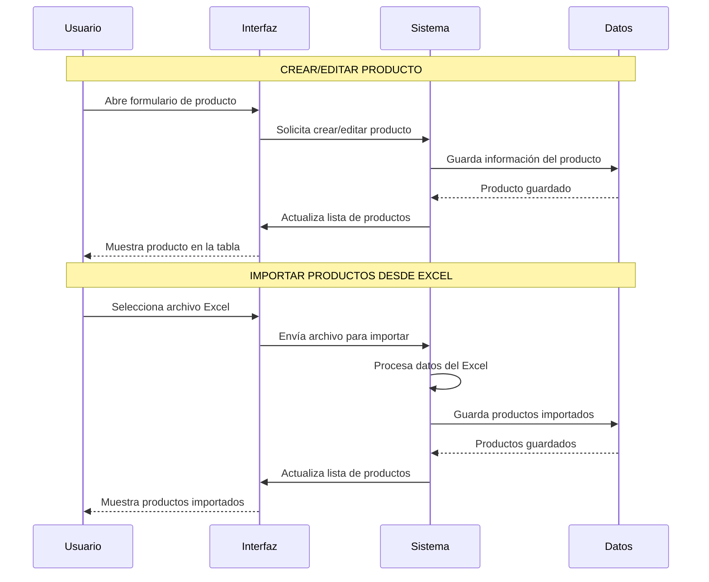
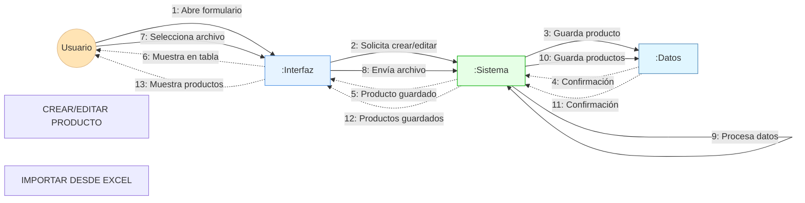
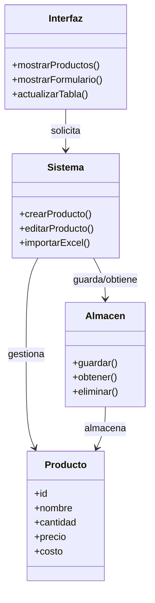

# Diagramas UML - Aplicación Actual

## 1. Diagrama de Casos de Uso

```mermaid
graph TB
    Usuario[Usuario/Administrador]

    UC1[Autenticarse]
    UC2[Seleccionar Empresa]
    UC3[Ver Dashboard]
    UC4[Gestionar Productos]
    UC5[Importar Excel]
    UC6[Exportar Excel]
    UC7[Gestionar Ventas]
    UC8[Ver Alertas de Stock]
    UC9[Configurar Precios]
    UC10[Ver KPIs]
    UC11[Buscar Productos]
    UC12[Controlar Cantidad]

    Usuario --> UC1
    Usuario --> UC2
    Usuario --> UC3
    Usuario --> UC4
    Usuario --> UC5
    Usuario --> UC6
    Usuario --> UC7
    Usuario --> UC8
    Usuario --> UC9
    Usuario --> UC10
    Usuario --> UC11
    Usuario --> UC12

    UC4 --> UC4a[Crear Producto]
    UC4 --> UC4b[Editar Producto]
    UC4 --> UC4c[Eliminar Producto]
    UC4 --> UC4d[Listar Productos]

    UC7 --> UC7a[Registrar Venta]
    UC7 --> UC7b[Ver Historial Ventas]
    UC7 --> UC7c[Ver Estadísticas Ventas]

    UC9 --> UC9a[Calcular Precios Recomendados]
    UC9 --> UC9b[Aplicar Precios]
    UC9 --> UC9c[Configurar Márgenes]

    UC10 --> UC10a[Ver Salud Inventario]
    UC10 --> UC10b[Ver Alertas Totales]
    UC10 --> UC10c[Ver Reabastecimiento]
    UC10 --> UC10d[Ver Ajuste Precios]

    style Usuario fill:#4A90E2,stroke:#357ABD,color:#fff
    style UC1 fill:#90EE90,stroke:#00AA00
    style UC2 fill:#90EE90,stroke:#00AA00
    style UC3 fill:#90EE90,stroke:#00AA00
    style UC4 fill:#FFD700,stroke:#FFA500
    style UC5 fill:#FFD700,stroke:#FFA500
    style UC6 fill:#FFD700,stroke:#FFA500
    style UC7 fill:#87CEEB,stroke:#4682B4
    style UC8 fill:#87CEEB,stroke:#4682B4
    style UC9 fill:#87CEEB,stroke:#4682B4
    style UC10 fill:#87CEEB,stroke:#4682B4
```

### Definición y Explicación del Diagrama de Casos de Uso

**¿Qué es?**
El Diagrama de Casos de Uso representa las funcionalidades del sistema desde la perspectiva del usuario. Muestra qué puede hacer el Usuario/Administrador con la aplicación, sin entrar en detalles técnicos de implementación.

**Relaciones:**

- **Actor Principal**: Usuario/Administrador, quien interactúa con todas las funcionalidades del sistema
- **Casos de Uso Principales**: Representan las acciones que el usuario puede realizar:
  - **Autenticación y Selección**: Autenticarse y seleccionar empresa
  - **Visualización**: Ver Dashboard y KPIs
  - **Gestión de Productos**: Crear, Editar, Eliminar y Listar productos (con sub-casos específicos)
  - **Importación/Exportación**: Importar y Exportar Excel
  - **Gestión de Ventas**: Registrar ventas, ver historial y estadísticas
  - **Alertas y Monitoreo**: Ver alertas de stock
  - **Configuración**: Configurar precios, márgenes y categorías
  - **Búsqueda y Control**: Buscar productos y controlar cantidades

**Flujo:**
El diagrama muestra una estructura jerárquica donde:

1. El usuario accede al sistema mediante autenticación
2. Selecciona la empresa (Hencho TCG o Mochima)
3. Accede al Dashboard principal
4. Desde allí puede realizar todas las operaciones de gestión
5. Los casos de uso principales se descomponen en sub-casos específicos (por ejemplo, "Gestionar Productos" incluye Crear, Editar, Eliminar y Listar)

**Relación con otros diagramas:**
Este diagrama proporciona el contexto general del sistema. Los diagramas de secuencia y colaboración detallan cómo se implementan estos casos de uso específicamente para la "Gestión de Productos".

## 2. Diagrama de Secuencia - Gestión de Productos

### Definición y Explicación del Diagrama de Secuencia

**¿Qué es?**
El Diagrama de Secuencia muestra la interacción temporal entre los participantes del sistema durante la ejecución de una funcionalidad. Representa el orden cronológico de los mensajes intercambiados entre los componentes, mostrando cómo colaboran para cumplir una tarea específica.

**Participantes:**

- **Usuario**: El actor humano que inicia las acciones
- **Interfaz**: La capa de presentación visual que el usuario ve y con la que interactúa
- **Sistema**: La lógica de negocio que procesa las solicitudes y coordina las operaciones
- **Datos**: La capa de persistencia donde se almacena la información

**Flujo - Crear/Editar Producto:**

1. El **Usuario** abre el formulario de producto desde la **Interfaz**
2. La **Interfaz** solicita al **Sistema** crear o editar el producto
3. El **Sistema** guarda la información del producto en **Datos**
4. **Datos** confirma al **Sistema** que el producto fue guardado
5. El **Sistema** actualiza la lista de productos en la **Interfaz**
6. La **Interfaz** muestra el producto en la tabla al **Usuario**

**Flujo - Importar Productos desde Excel:**

1. El **Usuario** selecciona un archivo Excel desde la **Interfaz**
2. La **Interfaz** envía el archivo al **Sistema** para importar
3. El **Sistema** procesa internamente los datos del Excel (validación, mapeo, limpieza)
4. El **Sistema** guarda los productos importados en **Datos**
5. **Datos** confirma al **Sistema** que los productos fueron guardados
6. El **Sistema** actualiza la lista de productos en la **Interfaz**
7. La **Interfaz** muestra los productos importados al **Usuario**

**Relación con otros diagramas:**

- **Con Diagrama de Casos de Uso**: Este diagrama detalla cómo se implementa el caso de uso "Gestionar Productos" y "Importar Excel"
- **Con Diagrama de Colaboración**: Muestra la misma funcionalidad pero desde una perspectiva estructural (quién colabora con quién) en lugar de temporal (cuándo ocurre cada interacción)
- **Con Diagrama de Clases**: Los participantes (Interfaz, Sistema, Datos) corresponden a las clases definidas en el diagrama de clases

**Características:**

- Las flechas sólidas (`->>`) representan mensajes síncronos (solicitudes)
- Las flechas punteadas (`-->>`) representan respuestas o confirmaciones
- El auto-loop en "Sistema" (paso 3 del importar) indica procesamiento interno

## 3. Diagrama de Colaboración - Gestión de Productos

### Definición y Explicación del Diagrama de Colaboración

**¿Qué es?**
El Diagrama de Colaboración muestra la estructura de colaboración entre objetos para cumplir una funcionalidad específica. A diferencia del diagrama de secuencia que muestra el orden temporal, este diagrama enfatiza las relaciones estructurales y los mensajes intercambiados entre los participantes.

**Participantes:**

- **Usuario**: Actor que inicia las acciones (representado como figura de palo `((Usuario))`)
- **Interfaz**: Objeto que maneja la presentación visual (`:Interfaz`)
- **Sistema**: Objeto que contiene la lógica de negocio (`:Sistema`)
- **Datos**: Objeto que gestiona el almacenamiento persistente (`:Datos`)

**Relaciones y Mensajes:**

- **Flechas sólidas (`-->`)**: Representan mensajes síncronos (solicitudes)
- **Flechas punteadas (`-.->`)**: Representan respuestas o confirmaciones asíncronas
- **Numeración**: Los mensajes están numerados secuencialmente (1-13) para mostrar el orden de ejecución

**Flujo - Crear/Editar Producto:**

1. **Usuario** → **Interfaz**: "Abre formulario" (inicia la interacción)
2. **Interfaz** → **Sistema**: "Solicita crear/editar" (envía solicitud)
3. **Sistema** → **Datos**: "Guarda producto" (persiste información)
4. **Datos** → **Sistema**: "Confirmación" (confirma guardado)
5. **Sistema** → **Interfaz**: "Producto guardado" (notifica éxito)
6. **Interfaz** → **Usuario**: "Muestra en tabla" (actualiza vista)

**Flujo - Importar desde Excel:** 7. **Usuario** → **Interfaz**: "Selecciona archivo" (inicia importación) 8. **Interfaz** → **Sistema**: "Envía archivo" (transfiere archivo) 9. **Sistema** → **Sistema**: "Procesa datos" (auto-loop, procesamiento interno) 10. **Sistema** → **Datos**: "Guarda productos" (persiste múltiples productos) 11. **Datos** → **Sistema**: "Confirmación" (confirma guardado) 12. **Sistema** → **Interfaz**: "Productos guardados" (notifica éxito) 13. **Interfaz** → **Usuario**: "Muestra productos" (actualiza vista)

**Relación con otros diagramas:**

- **Con Diagrama de Secuencia**: Muestra la misma funcionalidad pero desde una perspectiva estructural. Mientras el diagrama de secuencia muestra "cuándo" ocurre cada interacción, el de colaboración muestra "quién" colabora con "quién"
- **Con Diagrama de Casos de Uso**: Detalla cómo se implementa el caso de uso "Gestionar Productos" e "Importar Excel"
- **Con Diagrama de Clases**: Los objetos participantes (`:Interfaz`, `:Sistema`, `:Datos`) son instancias de las clases definidas en el diagrama de clases

**Características:**

- La notación `:nombreObjeto` indica que es una instancia de una clase
- El diagrama muestra claramente las dependencias entre componentes
- La numeración permite seguir el flujo de ejecución aunque el énfasis está en la estructura

## 4. Diagrama de Clases

### Definición y Explicación del Diagrama de Clases

**¿Qué es?**
El Diagrama de Clases representa la estructura estática del sistema, mostrando las clases principales, sus atributos, métodos y las relaciones entre ellas. Define la arquitectura del sistema desde el punto de vista de los componentes y sus responsabilidades.

**Clases Principales:**

1. **Interfaz**

   - **Responsabilidad**: Manejar la presentación visual y la interacción con el usuario
   - **Métodos**:
     - `mostrarProductos()`: Despliega la lista de productos en la tabla
     - `mostrarFormulario()`: Presenta el formulario para crear/editar productos
     - `actualizarTabla()`: Refresca la visualización de productos después de cambios

2. **Sistema**

   - **Responsabilidad**: Contener la lógica de negocio y coordinar las operaciones
   - **Métodos**:
     - `crearProducto()`: Lógica para crear un nuevo producto
     - `editarProducto()`: Lógica para modificar un producto existente
     - `importarExcel()`: Procesa y valida datos de archivos Excel

3. **Producto**

   - **Responsabilidad**: Representar la entidad de negocio principal
   - **Atributos**:
     - `id`: Identificador único del producto
     - `nombre`: Nombre del producto
     - `cantidad`: Stock disponible
     - `precio`: Precio de venta
     - `costo`: Costo del producto

4. **Almacen**
   - **Responsabilidad**: Gestionar la persistencia de datos
   - **Métodos**:
     - `guardar()`: Persiste información en el almacenamiento
     - `obtener()`: Recupera información del almacenamiento
     - `eliminar()`: Elimina información del almacenamiento

**Relaciones:**

1. **Interfaz → Sistema** ("solicita")

   - La Interfaz depende del Sistema para procesar las solicitudes del usuario
   - Relación de dependencia: la Interfaz necesita al Sistema para funcionar

2. **Sistema → Producto** ("gestiona")

   - El Sistema crea, modifica y manipula instancias de Producto
   - Relación de composición/agregación: el Sistema gestiona el ciclo de vida de los Productos

3. **Sistema → Almacen** ("guarda/obtiene")

   - El Sistema utiliza el Almacen para persistir y recuperar datos
   - Relación de dependencia: el Sistema necesita al Almacen para almacenar información

4. **Almacen → Producto** ("almacena")
   - El Almacen guarda instancias de Producto
   - Relación de asociación: el Almacen contiene referencias a Productos

**Flujo de Datos:**

1. El **Usuario** interactúa con la **Interfaz**
2. La **Interfaz** solicita operaciones al **Sistema**
3. El **Sistema** gestiona instancias de **Producto** según la lógica de negocio
4. El **Sistema** utiliza el **Almacen** para persistir los **Productos**
5. El **Almacen** almacena las instancias de **Producto**

**Relación con otros diagramas:**

- **Con Diagrama de Secuencia**: Las clases aquí definidas son los participantes en las interacciones temporales. Por ejemplo, cuando el diagrama de secuencia muestra "Sistema → Datos", corresponde a "Sistema → Almacen" en el diagrama de clases
- **Con Diagrama de Colaboración**: Los objetos `:Interfaz`, `:Sistema`, `:Datos` son instancias de las clases Interfaz, Sistema y Almacen respectivamente
- **Con Diagrama de Casos de Uso**: Las clases proporcionan la estructura que permite implementar los casos de uso definidos

**Arquitectura:**
El diagrama muestra una arquitectura en capas simplificada:

- **Capa de Presentación**: Interfaz
- **Capa de Lógica de Negocio**: Sistema
- **Capa de Persistencia**: Almacen
- **Capa de Datos**: Producto (entidad)

Esta estructura permite separar responsabilidades y facilitar el mantenimiento del sistema.

## Notas sobre los Diagramas

### Diagrama de Casos de Uso

- **Actor Principal**: Usuario/Administrador
- **Casos de Uso Principales**: Autenticación, Gestión de Productos, Importar/Exportar Excel, Gestión de Ventas, Configuración de Precios, Visualización de KPIs
- **Relaciones**: Inclusión (<<include>>) y Extensión (<<extend>>) implícitas en los sub-casos

### Diagramas de Secuencia

- Muestran la interacción temporal desde la perspectiva del usuario
- **Funcionalidad Principal: Gestión de Productos**
  - Incluye las operaciones principales: Crear/Editar Producto e Importar desde Excel
  - Enfoque centrado en el usuario, mostrando solo los pasos esenciales
  - Participantes simplificados: Usuario, Interfaz, Sistema, Datos
- **Cada diagrama de secuencia tiene su correspondiente diagrama de colaboración**

### Diagramas de Colaboración

- Muestran la colaboración entre componentes principales
- **Correspondencia 1:1 con diagrama de secuencia**:
  - **Funcionalidad Principal**: Gestión de Productos
- Enfoque simplificado y centrado en el usuario
- Utilizan notación UML estándar con objetos `:nombreObjeto` y mensajes numerados

### Diagrama de Clases

- Representa la estructura estática del sistema de forma simplificada
- Incluye solo las clases principales: Interfaz, Sistema, Producto, Almacen
- Enfoque centrado en la funcionalidad principal de gestión de productos
- Muestra relaciones de dependencia y uso entre clases
